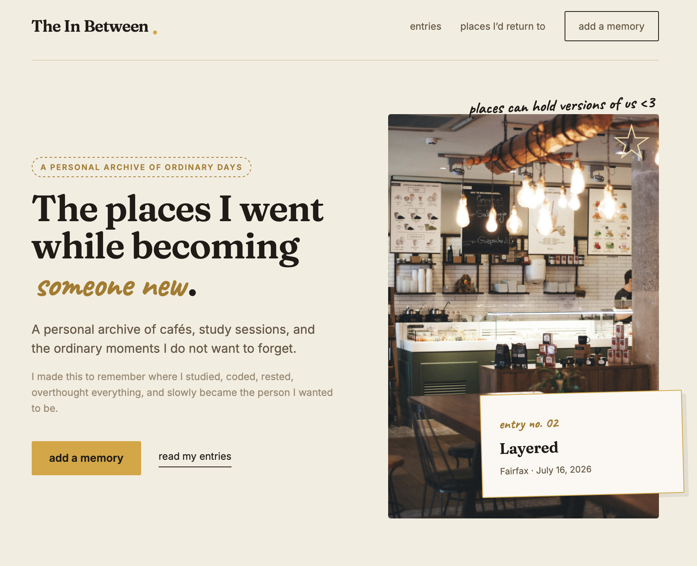

## The In Between

Inspired by afternoons spent studying in cafés around campus.

The In Between is a cozy digital journal for saving cafés, study sessions, and ordinary moments I don't want to forget.

Instead of tracking productivity, it helps me remember where I was, how the day felt, and the little details that made each moment memorable.

## Features

- Add personal journal entries
- Save memories using the browser's Local Storage
- Delete saved entries
- Track favorite places and focused days
- Responsive scrapbook-inspired design

## Demo 
https://canva.link/3yk1bxt7blf4iy4

## Built With

- HTML
- Sass
- CSS
- JavaScript
- Local Storage API

## What I Learned

This project helped me practice:

- DOM manipulation
- Form handling
- Working with the Local Storage API
- Responsive web design
- Organizing Sass into partial files 
- Organizing a larger front-end project

## Future Improvements

- Photo uploads with a Polaroid-style layout
- Interactive café map
- Search memories
- Filter entries by mood
- Café ratings
- Edit existing entries
- Export journal entries

## Credits

- Hero café photograph by [Keghan Crossland](https://unsplash.com/@keghancphoto) on Unsplash.

- Hero café2 photograph by [Clifford](https://unsplash.com/@cyzx) on Unsplash.

